การทดสอบถูกจัดทำขึ้นใน Lab ปิดภายใน Virtual Machine ซึ่งมีการติดตั้งโปรแกรมาสำหรับสังเกตุการณ์ไว้หลายตัว รวมถึงจำลองการทดสอบในรูปแบบต่าง ๆ ด้านล่างคือรายละเอียดสำคัญ
### รายละเอียดทั่วไป
#### Host OS version
* Windows 10 Pro, 64-bit
#### VM Software
* VMware Workstation Pro 25H2 virtual machine 
#### VMs
* Testing ground: Windows 10 pro 64-bit 22H2 (Build 19045.3803)
* Logging: Ubuntu 64-bit

## ในการทดสอบทางผู้เขียนได้แบ่งเป็น 3 ส่วน ได้แก่ 
#### 1.การทดสอบแบบปิดใช้งาน Windows Defender 
#### 2.การทดสอบแบบเปิดใช้งาน Windows Defender
#### 3.การทดสอบด้วย Software เฉพาะทาง

#### อ่านสรุปผลการทดลองและจุดอ่อนของ Loader ได้ที่นี่ [สรุปผลการทดลอง](#สรุปผลการทดลอง)

---
## 1.การทดสอบแบบปิดใช้งาน Windows Defender

ก่อนเริ่มเราได้ทำการปิดการใช้งานทั้ง Real-time protection, Cloud-delivered protection เพื่อทดสอบ Loader ว่าทำงานได้สมบูรณ์หรือไหมหลังจาก Build ออกจาก Visual Studio แล้ว

โดยการทดสอบกับ Windows Defender นี้จะเป็นการตรวจสอบควบคู่กับการใช้ `Sysmon` และ `Wazuh` โดยใช้ Ubuntu เป็นตัวเก็บ Log และแสดงผลบน Dashboard แบบ Cloud

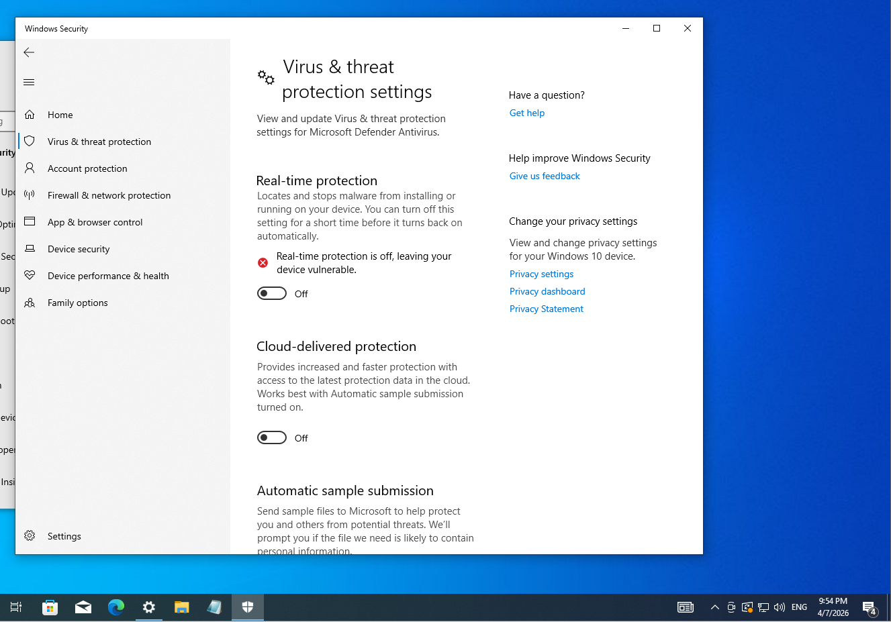

### Run ทดสอบตัว Payload
ผลคือ Shellcode ที่เป็น calc.exe ถูกรันขึ้นมาโดยไม่มีการ Crash และตัว Loader ก็ปิดตัวเองแทบจะทันทีที่ทำการ `Syscall` ไปยัง Kernel เพื่อเรียกใช้ฟังก์ชันต่าง ๆ สำหรับรัน Shellcode

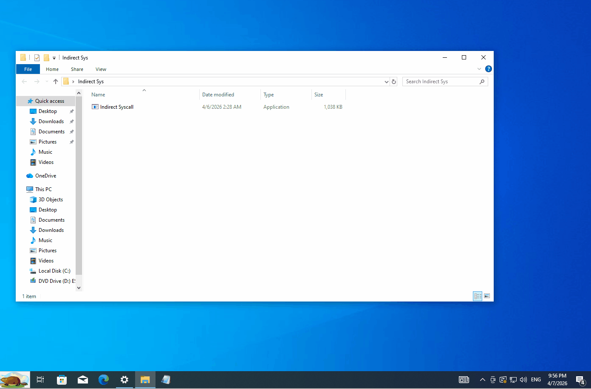

### Dashboard ของ Wazuh
หลังจากการใช้ Loader เราสลับกลับมาที่ตัว Dashboard ของ `Wazuh` ซึ่งทำงานโดยใช้ `Sysmon` ตรวจจับการเรียกใช้งาน API ในระดับลึกแล้วมันจะทำการส่งข้อมูล Memory management จากชั้น Kernel ข้ามไปให้ `Wazuh` ในฝั่ง Ubuntu วิเคราะห์ สรุป แสดงผลแบบแทบจะ Real-time 

จากใน Gif จะเห็นได้ว่า ไม่มี Log ที่ผิดปกติปรากฎขึ้น

ภาพ Log ด้านล่างแสดงถึง Event ที่เกิดขึ้นไม่มีการแจ้งเตือนถึงเหตุการณ์ที่ผิดปกติ

เสริม: T1078 (Valid Accounts) ใน Gif และภาพเป็นเพียง Noise แจ้งเตือนว่ามีการ Login เข้าระบบของ Windows ซึ่งไม่เกี่ยวข้องกับการทดสอบของเรา

---
## 2.การทดสอบแบบเปิดใช้งาน Windows Defender

คราวนี้เป็นการทดสอบโดยเปิดใช้งานการป้องกันเพื่อทดสอบผลลัพย์ที่แท้จริงของ Loader โดยเราจะเปิดใช้ Real-time protection เพื่อทดสอบว่า Defender จะป้องกันการใช้งาน `Indirect Syscall` ได้หรือไม่

จะเห็นว่า แม้จะเปิด Real-time protection แล้ว แต่ตัว Loader ก็ยังสามารถเปิด Shellcode ขึ้นมาได้แบบไม่มีปัญหา นั้นเพราะการใช้งาน Native API ซึ่งมันข้ามหัว Win API แบบปกติไปสื่อสารในชั้น Kernel โดยตรงเพื่อสั่งงาน CPU และด้วยการ Compile อย่างดีโดยเน้น Zero Dependency

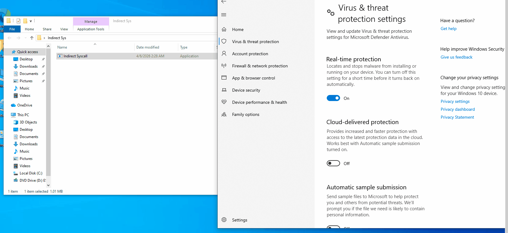
### Dashboard ของ Wazuh
หลังจากการใช้ Loader เราสลับกลับมาที่ตัว Dashboard ของ `Wazuh` แน่นอนว่าในครั้งนี้ก็ยังไม่มีการแจ้งเตือนในฝั่งของ Logger ของเรา

จากใน Gif ไม่มี Log ที่ผิดปกติปรากฎขึ้นเลยเช่นเดียวกันกับการทดสอบก่อนหน้า

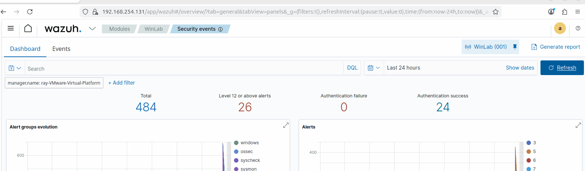

ภาพนิ่งจาก Log

--- 
## 3.การทดสอบด้วย Software เฉพาะทาง
ต่อไปจะเป็นการทดสอบกับ Software เฉพาะทาง ในการทดสอบนี้เพราะ Loader ของเราทำงานเร็วเกินไปจนบางโปรแกรมไม่สามารถหยุดตรวจสอบได้ เราเลยต้องแก้ไขตัว Loader เล็กน้อย 

ในส่วนท้ายสุดของ Code ผู้เขียนได้แก้จาก return 0; ที่จะปิดตัวเองทันที มาเป็นการใช้ `getchar();` เพื่อให้โปรแกรมหยุดรอรับการ Input ก่อนจะปิดตัวเอง

เมื่อเราแก้ไขตัว Loader แล้ว ต่อไปจะเป็นรายละเอียดของ Software สำหรับตรวจสอบเชิงลึก

---
# 1. Process Monitor

Process Monitor คือเครื่องมือวิเคราะห์พฤติกรรมเชิงลึกที่ปฏิบัติงานอยู่บนสถาปัตยกรรม Kernel-mode ผ่าน System-supplied Device Driver หน้าที่หลักในงานวิจัยและพัฒนาสถาปัตยกรรมซอฟต์แวร์ระดับ Low-Level คือ การดักจับ บันทึก และติดตามเหตุการณ์ หรือ Real-time Telemetry Tracking การโต้ตอบระหว่าง Process เป้าหมายกับตัวของ Windows OS

ในบริบทของการพัฒนา Loader ทาง Offensive Security เรานำ `ProcMon` มาใช้วัดเพื่อประเมินผลลัพธ์ใน 2 ด้าน

1.การตรวจสอบ Noise วิเคราะห์หาพฤติกรรมส่วนเกิน เช่น การพยายามเปิดไฟล์ที่ไม่จำเป็น, การแก้ไข Registry ที่ผิดวิสัย, หรือพฤติกรรมการเรียกใช้ไลบรารี (Image Load) ที่อาจกระตุ้นการทำงานของระบบ Behavioral Analysis ของ EDR

2.การประเมินสถาปัตยกรรมโค้ด ตรวจสอบความต่อเนื่องของ Execution Flow เพื่อยืนยันว่าโค้ด C++ ที่ถูกปรับแต่งมานั้น มีการบริหารจัดการทั้งประสิทธิภาพ ความเร็วและความปลอดภัย ในระบบ system memory อย่างสมบูรณ์แบบ ไร้ Bottleneck หรือการเรียกใช้ทรัพยากรระบบที่ซ้ำซ้อนซึ่งอาจส่งผลให้สูญเสียความรวดเร็วในการโหลด Payload หรือไม่

เราจะมาเริ่มกระบวนการตรวจสอบกัน

ภาพที่ 1: ขั้นแรกคือการตั้งค่า `ProcMon` เพราะเราต้องการโฟกัสไปที่ตัว Loader ของเรา ดังนั้นเราจำเป็นต้องเข้ามาปิดการดักจับ Process ที่ไม่เกี่ยวข้องทั้งหมด ทั้ง System หรือ Process ทั่วไป เพื่อให้ได้ข้อมูลที่ต้องการ

วิธีง่ายมาก เราจะ Add เอา Indirect Syscall.exe เข้าไปใน List โดยเราจะใช้ Process Name และ ตั้ง Value เป็นชื่อของ Loader เมื่อเสร็จแล้วก็ Apply เป็นการเสร็จ

ภาพที่ 2: ในส่วนภาพเล็ก ๆ นี้จะเป็นแถบเครื่องมือที่กำหนดการวิเคราะห์ตามลักษณะของข้อมูลจาก Process ของเรา โดยจะใช้งานเพียง 3 ตัวเท่านั้น ไล่จากซ้ายไปขวา

- **Show Process and Thread Activity** เพื่อดูจังหวะที่ระบบปฏิบัติการอนุญาตให้โพรเซสเกิดการสร้าง Thread ใหม่ สังเกตว่าคอลัมน์ Operation จะเป็น `Thread Create` หรือ `Process Start/Exit`

- **Show Profiling Events** เพื่อดูว่าโค้ดของเรามีการเรียกโหลดไลบรารี (DLL) พื้นฐานใดบ้างเข้าสู่หน่วยความจำ ตรงนี้สังเกตคอลัมน์ Operation ที่เป็น `Load Image`

จากนั้นเราจะมาเริ่มการดักจับกระบวนการหลังบ้าน Loader ของเรากัน

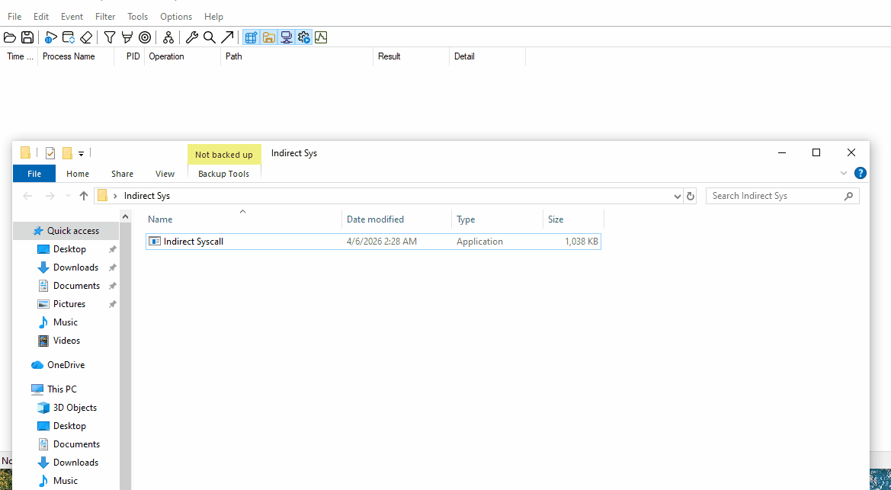

จาก Gif จะเห็นว่าเมื่อเริ่ม Capture และรันตัว Loader คอลัมน์ทั้งหมดไล่ตั้งแต่ Time ยาวจนไปถึง Details ก็โผล่ขึ้นมาทันที ซึ่งในขั้นตอนนี้เราจะถือว่าการเก็บ Log Process เสร็จสิ้นแล้ว สิ่งที่ทำต่อคือให้กด Capture อีกครั้งเพื่อหยุดเก็บข้อมูล แล้วเราจะได้ผลลัพย์มาวิเคราะห์สิ่งที่เกิดขึ้น

ภาพที่ 3: นี้คือรายละเอียด Log ทั้งหมด จะเห็นได้ว่ามีเพียงแค่ 21 Events เท่านั้น เราจะมา Breakdown กันว่าแต่ละส่วนมีอะไรบ้างเพื่อให้เห็นภาพชัดเจนมากขึ้น

* **บรรทัด 1 | `Process Start`:** OS สร้าง PEB - Process Environment Block ให้กับ `Indirect Syscall.exe` ในหน่วยความจำ

* **บรรทัด 2 | `Thread Create` (TID 6924):** OS สร้าง Main Thread มาเพื่อเตรียมรันคำสั่งแรกในฟังก์ชัน `main()`

* **บรรทัด 3 | `Load Image - Indirect Syscall.exe`:** OS Loader ทำการกางไฟล์ `.exe` จาก Disk ลงสู่พื้นที่ **System Memory** โดย Image Base คือ `0x140000000` เป็นที่อยู่มาตรฐานของโปรแกรม 64-bit

* **บรรทัด 4 | `Load Image - ntdll.dll`:** Windows โหลด Library เชื่อมต่อกับ Kernel เข้ามา โค้ด `Indirect Syscall` จะวิ่งไปอ่านค่า SSN จาก Memory ของเหยื่อ เตรียม bypass inline hook ที่ถูกวางไว้

* **บรรทัด 5-6 | `Load Image - kernel32.dll, KernelBase.dll`:** OS โหลดชุดคำสั่งพื้นฐาน (API) สำหรับจัดการหน่วยความจำและ Process เข้ามาเตรียมไว้

* **บรรทัด 7 | `Process Create - Conhost.exe`:** เนื่องจาก Loader ถูก Compile เป็นแบบ Console Application ระบบปฏิบัติการจึงต้องแวะไปเรียก `conhost.exe` ให้มาช่วยวาดหน้าต่างสีดำ ๆ ให้เรา

* **บรรทัด 8 | `Thread Create` (TID 5112):** สร้าง Thread มารองรับการวาดหน้าจอ (I/O) ของ Console

* **บรรทัด 9-10 | `Load Image - sechost.dll, rpcrt4.dll`:** เป็นไลบรารีที่ถูก `KernelBase.dll` ดึงเข้ามาแบบ Dependencies เพื่อจัดการระบบ Security Policy และ RPC เบื้องหลัง

* **บรรทัด 11 | `Thread Create` (TID 372):** Thread จัดการพื้นหลังที่ OS สร้างขึ้นมาเผื่อไว้

* **บรรทัด 12 | `Load Image - bcrypt.dll`:** Library จัดการการเข้ารหัสของ Windows ถูกโหลดขึ้นมาเตรียมพร้อมใน Memory

* **บรรทัด 13 | `Thread Create` (TID 2732):** Thread ของระบบ หรือ System Worker Thread

* **บรรทัด 14 | `Process Create - calc.exe`**: นี่คือผลลัพธ์จากการที่ Shellcode ของเราทำงานสำเร็จ

   สังเกตุว่า `ProcMon` มองเห็นแค่ Destination คือ `calc.exe` เด้งขึ้นมา แต่มันมองไม่เห็นบรรทัดที่ Code ทำ `VirtualAlloc` หรือ `CreateThread` เลย เพราะ Loader ของเรา JMP แบบที่เขียนใน ASM Stub ไปทำ `Syscall` ใน System Memory โดยตรง เร็วมากในระดับ millisecond จน Censor ดักจับและส่ง Log ขึ้น `ProcMon` ไม่ทัน 

   นี่คือความปลอดภัยระดับสูงสุดของเทคนิคนี้ ไร้ร่องรอยกระบวนการทั้ง จอง-สร้าง-เขียน-รัน แบบเบ็ดเสร็จ และถ้ามันถูกใช้งานกับ Malware ประเภท Memory Injection (`Fileless`) คิดดูว่ามันจะน่ากลัวขนาดไหนหากพึ่งพาการตรวจจับเดิม ๆ อย่าง Static Scanning หรือ การตรวจจับในชั้น Ring 3 อย่างเดียว

* **บรรทัด 15 | `Thread Exit` (TID 5112):** Thread ที่รับผิดชอบหน้าจอ Console หมดหน้าที่และปิดตัวลง

* **บรรทัด 16-17 | `Load Image - kernel.appcore.dll, msvcrt.dll`:** Library ชุดสุดท้ายถูกดึงเข้ามาตอนที่ OS กำลังจะเข้าสู่ช่วง Terminate Process แน่นอนว่าคงสงสัยทำไมถึงยังมีการทำลาย DLL ที่ดูไม่เกี่ยวข้อง เพราะถึงเราจะ Compile แบบ `/MT` แต่พวกฟังก์ชันของ OS เองก็ยังต้องพึ่งพา `msvcrt.dll` ของระบบอยู่ดี

* **บรรทัด 18-19 | `Thread Exit` (TID 2732, 372):** Thread พื้นหลังของระบบถูกสั่ง (`CloseHandle`) อย่างเป็นระเบียบ

* **บรรทัด 20 | `Thread Exit` (TID 6924):** Main Thread วิ่งสุดฟังก์ชัน `main()` ตัว Code หลักของเราทำงานจบลงอย่างสมบูรณ์

* **บรรทัด 21 | `Process Exit`:** ตัว Process ของ `Indirect Syscall.exe` ปิดตัวลงด้วยรหัส `Exit Status: 0` (SUCCESS) ทรัพยากรทั้งหมดถูกส่งคืนให้ Windows โดยไม่ Crash หรือทิ้ง Memory Leak ไว้ให้เป็นเป้าสายตา จบการทำงานของ Loader ทิ้ง Shellcode ให้ทำงานไป ในที่นี้คือ Calc.exe ที่ค้างไว้บน Desktop 

สังเกตว่าตั้งแต่ `Process Start` ไปจนถึง `Process Exit` ไม่มี Event ขยะโผล่มาเลย โค้ดไม่มีการไปยุ่งเกี่ยวกับ Registry ที่ไม่เกี่ยวข้อง ไม่มีการยุ่งกับไฟล์ใน Directory อื่น ทำให้ CPU Cycle น้อยมากและตัว Payload ทำงานได้ด้วยความเร็วสูงสุด ไม่ไปแหย่ระบบ Behavioral Heuristics ของ EDR ให้ทำงาน

จังหวะ `Load Image` ตัว Code ดึงมาแค่ `ntdll.dll`, `kernel32.dll`, `KernelBase.dll` และตัวที่จำเป็นจริง ๆ เท่านั้น ไม่มีการดึง Library แปลกปลอมเข้ามาใน **System Memory** ให้น่าสงสัย เพราะเราเล่น Build Compiler แบบ /MT 

บรรทัดที่เขียนว่า `Process Create` ชี้ไปที่ `C:\Windows\SYSTEM32\calc.exe` ตรงนี้คือจุดสำคัญที่สุด `ProcMon` ซึ่งเป็น Kernel Driver มองเห็นแค่ว่ามีโพรเซสเครื่องคิดเลขถูกสร้างขึ้นมา แต่มันจับจังหวะการใช้ `Indirect Syscall` แอบเข้าไป Allocate และ Write ตัว Shellcode ลงในหน่วยความจำ ไม่สามารถูกดักจับได้เลย การมุดลง Kernel ทำได้เนียนจนระบบระดับล่างยังบันทึกพฤติกรรมผิดปกติไม่ทัน

ตอนท้ายเราเห็น `Thread Exit` 5-6 ครั้ง ตามด้วย `Process Exit` พร้อม `Exit Status: 0` (SUCCESS) นี่คือความสวยงามของโค้ดครับ เมื่อ `calc.exe` ทำงานสำเร็จ ตัว Loader ก็ยุติการทำงานและส่งคืนทรัพยากรทั้งหมดกลับสู่ System Memory ของเหยื่อ ทันที ไม่ทิ้งเศษซากเธรดค้างไว้ในแรมให้โดนสแกนเจอตามหลัง

---
# 2. System Informer

**System Informer** หรือชื่อเดิมที่หลายคนคุ้นเคยคือ **Process Hacker** คือโปรแกรมจัดการระบบที่เป็นตัวอัปเกรดของ Task Manager มันถูกออกแบบมาเพื่อให้นักพัฒนาซอฟต์แวร์และสาย Security มองเห็นสิ่งที่เกิดขึ้นใน Windows

**Objective** คือเพื่อตรวจสอบร่องรอยการทำงานและการจองพื้นที่ของ Shellcode (Payload) ใน System Memory รวมถึงประเมินความปลอดภัยของสถาปัตยกรรม Loader ที่พัฒนาด้วยเทคนิค `Indirect Syscalls` ว่าสามารถหลบเลี่ยงการตรวจจับจากการทำ Memory Scanning ของ EDR ได้หรือไม่

### หน้าที่ของ System Informer ในงานนี้คือ

- **Handle & DLL** ส่องได้ว่าโปรแกรมนั้นกำลังแอบเรียกใช้ไฟล์ไหน หรือโหลด Library ตัวไหนมาใช้บ้าง 

- **Memory Editor** สามารถเข้าไปดู "ข้อมูลในแรม" ของโปรแกรมนั้น ๆ ได้เลย สามารถเห็น String หรือข้อความที่ซ่อนอยู่ในโปรแกรมได้

รายละเอียดจะอธิบายประกอบภาพด้านล่าง

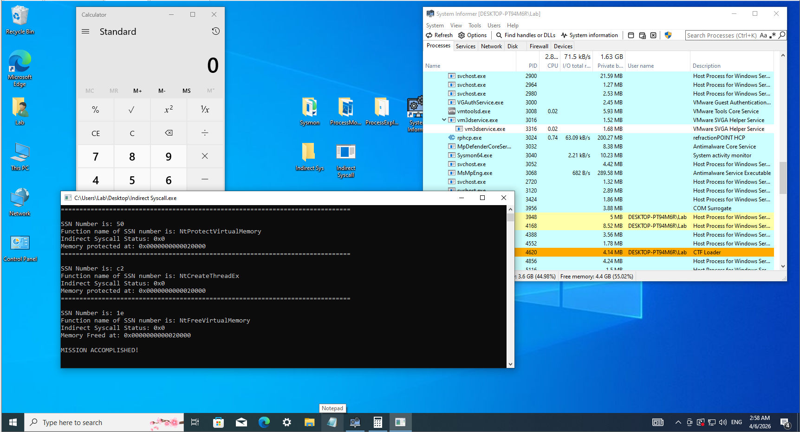

ภาพที่ 1: การใช้งาน System Informer หลังจาก Run ตัว Loader ของเราในสภาวะค้างจาก `getchar();` จะเห็นได้ว่า ตัว CMD ค้างไว้ที่คำว่า Mission Accomplished! และไม่ปิดตัวเองแบบการทดสอบครั้งก่อน

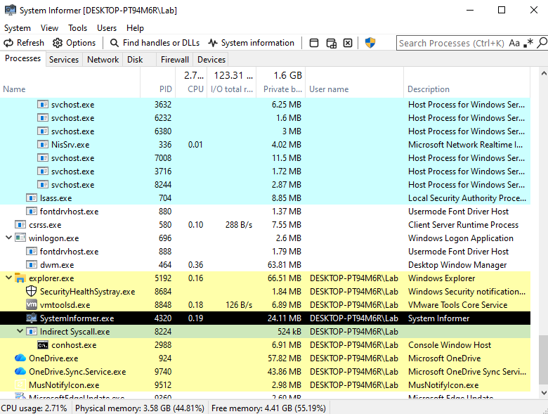

ภาพที่ 2: เราจะเข้าดูรายละเอียดของ Loader ในที่นี้คือ Indirect Syscall.exe พระเอกของเรานั่นเอง Double click เข้าไปตรวจสอบด้านใน

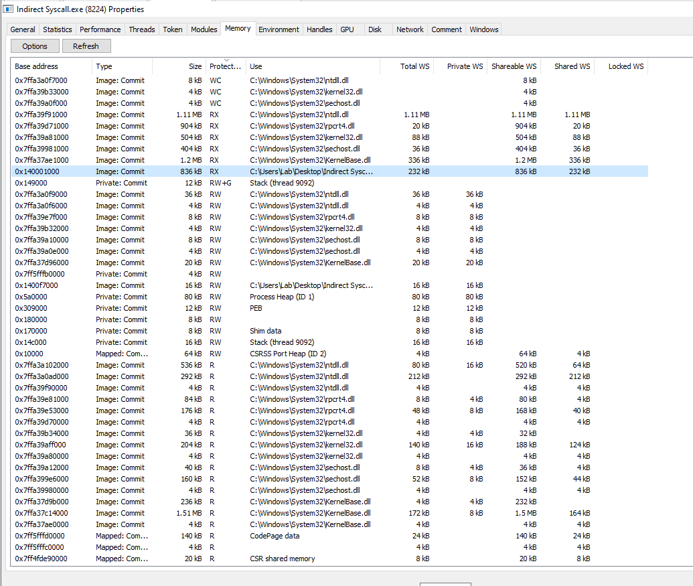

ภาพที่ 3: รายละเอียดเชิงลึกที่ System Informer บอกเรา มีตั้งแต่ Base Address ไล่ไปจนถึง Type ของไฟล์ เกณฑ์การวิเคราะห์คือทำการสแกนและวิเคราะห์โครงสร้างหน่วยความจำของ Loader โดยมุ่งเน้นไปที่ 3 องค์ประกอบหลักที่ EDR ใช้เป็นเกณฑ์ในการชี้วัดความผิดปกติ

- **Type** ตรวจจับการจองพื้นที่แบบ Dynamic Allocation ที่ Process สร้างขึ้นมาเอง

- **Protection** เฝ้าระวังบล็อกหน่วยความจำที่มีสิทธิ์เป็น `RWX` (Read/Write/Execute) ซึ่งเป็นเป้าหมายหลักของระบบป้องกัน หรือพื้นที่ `RX` (Read/Execute) ที่น่าสงสัย

- **Use** ตรวจสอบหาพื้นที่แบบ Unbacked Memory พื้นที่หน่วยความจำลอยตัวที่ไม่มีไฟล์ Image เช่น `.dll` หรือ `.exe` จากดิสก์มารองรับ

เสริมข้อมูล `Type` **Private: Commit**

- **Stack** หน่วยความจำสำหรับเก็บตัวแปรชั่วคราวและลำดับการเรียกฟังก์ชัน ในภาพของมีระบุชัดเจนว่า "Stack (thread 9092)"

- **Heap** หน่วยความจำสำหรับเก็บข้อมูลที่โปรแกรมจองตอน Runtime เช่น การใช้ `malloc` ใน C หรือ `new` 

- **PEB/TEB** โครงสร้างข้อมูลภายในของ Windows สำหรับจัดการ Process และ Thread

- **Shellcode/Malicious Data** หากมีการทำ Code Injection หรือรัน Shellcode มันมักจะถูกวางไว้ในพื้นที่ที่เป็น Private: Commit เช่นกัน

---
### ผลการประเมินจากการรัน Loader และตรวจสอบสถานะ Memory Map

- Zero RWX & Backed Memory Compliance
  ไม่ปรากฏบล็อกหน่วยความจำที่ขอสิทธิ์ระดับ `PAGE_EXECUTE_READWRITE` (RWX) ในโพรเซสเป้าหมายเลยแม้แต่ไบต์เดียว เป็นการลบจุดบอดที่ Memory Scanner ของ EDR ทุกค่ายใช้เป็นเกณฑ์หลักในการตั้งข้อสงสัยและทำลายโพรเซสทิ้ง นอกจากนี้พื้นที่ที่ต้องการสิทธิ์ประมวลผล (`RX`) ทั้งหมด ถูก (Backed) กับไฟล์ Image แท้ของระบบ (เช่น `ntdll.dll` หรือ `kernelbase.dll`) ทำให้ไม่มีพื้นที่ Unbacked Executable Memory ลอยตัวอยู่เลย

- การหลบหลีกเซนเซอร์และพฤติกรรม หรือ Telemetry & Behavioral Evasion
  Sensor อย่าง `Sysmon` ไม่มีการบันทึก Event ID 8 (`CreateRemoteThread`) และ Event ID 10 (Process Access) กลับไปยังระบบของ `Wazuh` เป็นเครื่องยืนยันว่าการใช้เทคนิค `Indirect Syscalls` สามารถเจาะทะลุการดักฟังแบบ User-land Hooks ลงไปสั่งงาน Kernel ได้โดยตรง การทำ Execution Flow มีความรัดกุมจนระบบปฏิบัติการไม่สามารถบันทึก Call Trace หรือการข้ามโพรเซสที่ผิดปกติได้

- กลไกการจัดการและทำลายหลักฐาน
  เมื่อ Payload (calc.exe) ถูกสั่งงานจนสำเร็จ สถานะของหน่วยความจำในโปรแกรมหลักกลับมาอยู่ในสภาวะปกติทันที

  โครงสร้าง Loader มีการควบคุมการทำงานของ Memory Allocation อย่างไร้ที่ติ เมื่อลอจิกทำงานจบ ได้มีการ Free Memory ทันที ทำให้ไม่มีโค้ดขยะหรือพื้นที่อันตรายแช่ค้างไว้ในระบบ เพื่อป้องกันการตรวจสอบย้อนหลัง

สถาปัตยกรรมของ Loader มีการบริหารจัดการ **ประสิทธิภาพ ความเร็วและความปลอดภัย ในระบบ system memory** ระดับสูงมาก โค้ดสามารถจัดสรรพื้นที่และทำงานได้โดยไม่ทิ้งร่องรอย Private Executable Memory เอาไว้เลย ทำให้การทำงานซ่อนเร้นจากการถูกตรวจสอบด้วยเทคนิค Memory Scanning ได้อย่างสมบูรณ์แบบ 100%

---
# 3. `WinDbg`

ในส่วนนี้เราจะมาตามดูสิ่งที่เรียกว่า Execution Flow ของตัว `Indirec Syscalls` ในระดับ Register ซึ่งมีสิ่งที่น่าสนใจมากระหว่างการทดสอบ ก่อนที่เราจะไปศึกษาสิ่งที่เกิดขึ้น ขอเกริ่นนำก่อนว่า อะไรคือ `WinDbg` 

**`WinDbg`** หรือชื่อเต็ม Windows Debugger คือเครื่องมือสำหรับการ Debug อเนกประสงค์ที่พัฒนาโดย Microsoft ออกแบบมาเพื่อใช้ในการวิเคราะห์พฤติกรรมของระบบปฏิบัติการ Windows และซอฟต์แวร์ที่ทำงานอยู่บนระบบดังกล่าว โดยมีขีดความสามารถครอบคลุมทั้งการตรวจสอบในระดับแอปพลิเคชันและระดับโครงสร้างส่วนลึกของระบบอย่าง Kernel

`WinDbg` มีความโดดเด่นเหนือกว่า Debugger ทั่วไปเนื่องจากสามารถทำงานได้ใน 2 โหมดหลัก

- **User-Mode** ใช้สำหรับการวิเคราะห์และแก้ไขจุดบกพร่องของ Application-level รวมถึง Service ต่างๆ ของระบบที่รันอยู่ในพื้นที่หน่วยความจำของผู้ใช้

- **Kernel-Mode** ใช้สำหรับการวิเคราะห์โครงสร้างภายในของระบบปฏิบัติการชั้น Kernel-level โดยสามารถเข้าถึงและควบคุมสถานะของระบบในระดับที่ลึกที่สุด ซึ่งมักใช้ในการหาสาเหตุของอาการระบบหยุดทำงานหรือจอฟ้าในแบบที่ Debugger ทั่วไปหาไม่พบ

เราจะมาใช้ความสามารถของ `WinDbg` ในการยืนยันว่าหน้าตา Stack ในโค๊ดของเราเวลาใช้งานจริงมันหน้าตาเป็นยังไง
### 1. โครงสร้างคำสั่ง

ทุกฟังก์ชันเหล่านี้ `NtAllocate, NtWrite, NtProtect, NtCreateThreadEx, NtFreeVirtualMemory` มีขั้นตอนการทำงาน 3 ส่วนหลัก ได้แก่

1. **`mov r10, rcx`** เป็นการย้ายค่าพารามิเตอร์ตัวแรกจาก Register `rcx` ไปยัง `r10` เนื่องจากในระดับ Kernel Mode คำสั่ง `syscall` จะทำลายค่าใน `rcx` เพื่อใช้เก็บค่า Return Address ระบบจึงต้องสำรองค่าไว้ใน `r10` ตามข้อกำหนดของ Windows x64 Calling Convention

2. **`mov eax, <Value>`** นี่คือส่วนที่สำคัญที่สุดสำหรับการทำ `Indirect Syscall` เรียกว่า **System Service Number (SSN)** หรือเลขดัชนีที่บอก Kernel ว่าเราต้องการเรียกใช้บริการตัวไหน

3. **`test ... / jne ... / syscall`** ระบบจะตรวจสอบว่าเครื่องรองรับการเรียกผ่าน `syscall` หรือไม่ จากนั้นจะรันคำสั่ง **`0f05` (`syscall`)** เพื่อเปลี่ยนสถานะการทำงานจาก User Mode เข้าสู่ Kernel Mode

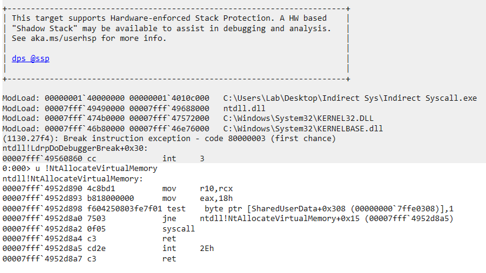

ภาพ: การเช็ค `NtAllcateVirtualMemory`

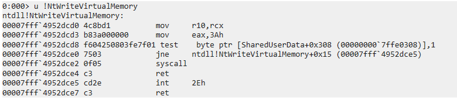

ภาพ: การเช็ค `NtWriteVirtualMemory`

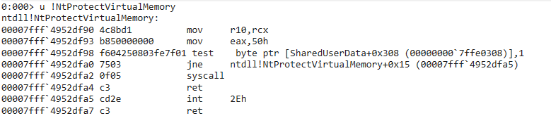

ภาพ: การเช็ค `NtProtectVirtualMemory`

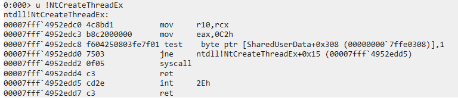 

ภาพ: การเช็ค `NtCreateThreadEx`

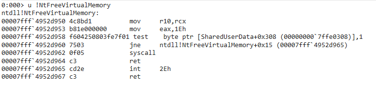

ภาพ: การเช็ค `NtFreeVirtualMemory`

---
### 2. รายละเอียดเฉพาะของแต่ละฟังก์ชัน (จากภาพ)

จากภาพถ่ายหน้าจอ เราสามารถระบุเลข **SSN** ของแต่ละบริการใน Windows Build นั้นๆ ได้ดังนี้

| **ฟังก์ชัน (Native API)**   | **เลข SSN (ใน Register eax)** | **ตำแหน่งของคำสั่ง syscall (ในภาพ)** |
| --------------------------- | ----------------------------- | ------------------------------------ |
| **NtAllocateVirtualMemory** | `18h`                         | `00007fff'4952d8a2`                  |
| **NtWriteVirtualMemory**    | `3Ah`                         | `00007fff'4952dce2`                  |
| **NtProtectVirtualMemory**  | `50h`                         | `00007fff'4952dfa2`                  |
| **NtCreateThreadEx**        | `0C2h`                        | `00007fff'4952edd2`                  |
| `NtFreeVirtualMemory`       | `1Eh`                         | `00007fff'4952d962`                  |

ภาพ: แสดงให้เห็นว่า ตัว Loader ทำงานสำเร็จ 100% จากการลอง Breakpoint จับที่ Gadget Address ซึ่งเป็นการเปลี่ยน Address จุดนึงในฟังก์ชัน วิธีเดียวกับการ Hooking ของ EDR  

จากภาพ เราจะเป็นลำดับการทำงานของ Stack Frame ได้ว่า

- **Frame 07 - 06**: จุดเริ่มต้นของ Process

- **Frame 05 - 03:** ช่วงเวลาที่โค้ดกำลังทำงาน ตั้งแต่เริ่มโปรแกรม, วิ่งหา SSN, ยิง Indirect Syscall ทั้ง 4 ตัว, ปล่อย Payload จนเครื่องคิดเลขทำงานสำเร็จ

  สังเกตว่าไม่มีร่องรอยของฟังก์ชัน API สร้างโพรเซสหรือจองแรมโผล่มาแถวนี้เลย นั่นแปลว่า `Indirect Syscall` ทำงานล่องหนได้สำเร็จ 100% 

- **Frame 02:** ทำการเรียก API `ExitProcess()` เพื่อสั่งปิดโปรแกรมตัวเอง

- **Frame 01:** เริ่มกระบวนการไล่ปิด Thread, คืนหน่วยความจำ และเคลียร์ทรัพยากรที่โปรแกรมนี้จองไว้

- **Frame 00:** ระบบปฏิบัติการยิงคำสั่งลง Kernel เพื่อขอให้ทำลายโพรเซส `Indirect_Syscall.exe` ทิ้งอย่างสมบูรณ์ และวินาทีนี้เองที่มันไปเหยียบ Breakpoint ของ `WinDbg` พอดี แบบที่เห็นในภาพด้านบน

---
## สรุปผลการทดลอง

จากการออกแบบและพัฒนา Proof of Concept ของ Loader ที่ทำงานด้วยเทคนิค `Indirect Syscall` การทดสอบได้ถูกดำเนินการผ่านเครื่องมือวิเคราะห์เชิงลึก 3 ระดับ เพื่อประเมินประสิทธิภาพและความสามารถในการหลบหลีก มีผลการทดสอบดังนี้

**1. การตรวจสอบ Execution Flow และ Hardware ผ่าน `WinDbg`**
   ผลการดีบักยืนยันว่ากลไก Inline Assembly ที่พัฒนาขึ้น สามารถควบคุม CPU Registers ได้อย่างสมบูรณ์แบบก่อนการสลับจาก User-mode ลงสู่ Kernel-mode โดยสามารถดึงหมายเลข System Service Number (SSN) ลงในรีจิสเตอร์ `EAX` และคัดลอกพารามิเตอร์ไปยัง `R10` ได้อย่างถูกต้องตามมาตรฐาน x64 `Windows Syscall` 

**2. การวิเคราะห์โครงสร้างหน่วยความจำ ผ่าน System Informer** 
   การตรวจสอบ Virtual Memory Layout ยืนยันว่า ตัว Loader สามารถจัดการหน่วยความจำและรันได้สำเร็จ อย่างไรก็ตาม เครื่องมือได้เปิดเผยให้เห็นถึงข้อจำกัดของสถานะการเป็น `PoC` คือการปรากฏของพื้นที่หน่วยความจำประเภท `Private: Commit` ที่มีสิทธิ์ `RX` หรือ `RWX` (`PAGE_EXECUTE_READ` และ `PAGE_EXECUTE_READWRITE`) ซึ่งเป็นหน่วยความจำแบบ Unbacked Memory แม้ว่ากลไก `Syscall` จะมีความแนบเนียน แต่ร่องรอยในระดับ Memory Type นี้ยังคงเป็นจุดสังเกตหลักที่ระบบ Memory Scanner ของ EDR สามารถตรวจจับได้ ซึ่งระบุได้ชัดเจนว่าจำเป็นต้องมีการใช้เทคนิคอื่น เช่น Module Stomping หรือ Reflective DLL Injection ในการพัฒนาขั้นต่อไปให้แนบเนียนมากขึ้น

**3. การตรวจสอบ Behavioral Telemetry ผ่าน Process Monito** 
   ในมุมมองของการวิเคราะห์ด้วยการทำ Logging การเรียกใช้งาน API ผ่าน `Indirect Syscall` ทำให้การเคลื่อนไหวมีความ Stealth อย่างมีนัยสำคัญ เนื่องจากไม่มีการเรียกใช้ Win32 API ผ่านตามเส้นทางปกติ Call Stack จึงขาวสะอาด ทำให้การตรวจจับพฤติกรรมที่ดักรอสังเกตการณ์อยู่ที่รอยต่อของ User-mode API ไม่สามารถบันทึกกิจกรรมที่ผิดปกติหรือจัดทำ Risk Scoring ที่ผิดปกติได้

---
## ปัญหาและจุดอ่อนของ Loader ฉบับ `PoC`

แม้ว่า Proof of Concept (`PoC`) ของ `Indirect Syscall` ในปัจจุบันจะสามารถหลบเลี่ยง Userland Hooking ได้สำเร็จ แต่เพื่อยกระดับสถาปัตยกรรมนี้ไปสู่ระดับ **Weaponized Payload** ที่สามารถทำงานได้อย่างสมบูรณ์แบบในสภาพแวดล้อมที่ถูกคุ้มกันด้วย Enterprise EDR (เช่น `CrowdStrike`, `SentinelOne`) จำเป็นต้องมีการพัฒนาต่อยอดใน 4 มิติเชิงลึกต่อไปนี้
#### 1. No-CRT Implementation

ภาพ: **จากล่างขึ้นบน** สังเกตุที่ Frame 11 มีการเรียกใช้ `LoadLibraryEx` ซึ่งเป็น DLL แบบปกติ จุดเริ่มต้นของความล้มเหลว

   * **Frame 18:** เริ่มต้น Thread
   * **Frame 17-12:** Loader ทำการจองพื้นที่
   * **Frame 11:** มีการเรียก DLL `LoadLibraryEx` ซึ่งไม่ควรถูกเรียกขึ้นมาทำงาน
   * **Frame 10-9:** เกิดการใช้งาน `Ldr` หาฟังก์ชันและโหลดไฟล์ต่าง ๆ ขึ้นมาเตรียมใช้
   * **Frame 8-6:** CRT เจ้าปัญหาเริ่มทำงาน เตรียมจอง Heap สำหรับฟังก์ชันไม่พึงประสงค์อย่าง malloc()
   * **Frame 5:** เริ่มจอง Heap ด้วย `KERNELBASE!HeapCreate`
   * **Frame 4-1:**  จอง Heap ให้ระบบ
   * **Frame 0:** เรียกใช้ `NtFreeVirtualMemory` 

   1.1 **ปัญหาปัจจุบัน**
   การใช้ C Run-Time (CRT) Library มาตรฐาน เช่น `iostream`, โครงสร้างของ C++ ทั่วไป ทำให้เกิด Noise ในระบบปฏิบัติการ ตัวจัดการ Heap ของ C++ มักจะแอบเรียกใช้ `NtFreeVirtualMemory` โดยอัตโนมัติเพื่อขยายพื้นที่หน่วยความจำ ซึ่งเป็นพฤติกรรมที่ควบคุมไม่ได้และเสี่ยงต่อการถูกตรวจจับ
   
   ฟังดูย้อนแย้งสักหน่อย แต่ว่าทำไมถึงมีการเรียกใช้ `NtFreeVirtualMemory` ผ่านกลไปของ `Indirect Syscall` แล้วทำไมยังต้องเรียกผ่าน DLL ขั้นสูงแบบ `LoadLibraryEx` อีก? Loader ของเราใช้งานได้จริง มีการ Sort หา SSN และใช้งาน Gadget ที่หามาได้จริง มีการเรียกใช้ฟังก์ชัน Native API จริงแบบที่ออกแบบไว้ 100% 

   แน่นอนว่าสำหรับตัว Loader ของเรา มันทำงานจบจริง แต่ถึงยังนั้น Noise ที่เกิดขึ้นก็ยังสามารถเป็นร่องรอยการตรวจจับจาก EDR ระดับสูงได้อยู่ดี เพราะตัว Loader ของเรามีการใช้งาน Library มาตราฐานที่ไม่จำเป็นอย่าง iostream ในขั้นตอน Debug ที่เบื้องหลังมีการเรียกใช้ฟังก์ชัน malloc() Free() หรือ `LoadLibraryEx` โดยที่เราไม่รู้ตัว
   
   กล่าวคือแม้จะไม่ใช่อุปสรรคที่ทำให้ Loader ของเราไม่ทำงานพลาด แต่ก็เป็นร่องรอยที่มีมากพอจะทำให้ระบบการแจ้งเตือนของ EDR จับพิรุธได้

   1.2 **แนวทางการพัฒนา** 
   การแก้ไขคือต้องหยุดพึ่งพา CRT ทั้งหมด (No-CRT) โดยการเขียน Custom Entry Point ขึ้นมาใช้งานเองแทน **`int main()`** และพัฒนา `Custom Intrinsics` เช่น โค้ดสำหรับทำ `memcpy` หรือ `memset` ด้วยตัวเอง นอกจากจะไม่ทำให้เกิด Noise ใน Process แล้วยังทำให้ขนาดไฟล์มีขนาดเล็กลงมากในระดับ 1-3 KB

   1.3 **ผลลัพธ์ที่คาดหวัง** 
   ขนาดไฟล์ Executable จะลดลงอย่างมหาศาลและรับประกันได้ว่า Memory Profile ของ Process จะมีความเงียบ จะไม่มีการเรียก API ระดับล่างใดๆ เกิดขึ้นนอกเหนือจากโค้ด `Indirect Syscall` ที่เราตั้งใจเขียนไว้เท่านั้น เป็นการควบคุม Memory แบบ 100% ตามที่คาดหวัง
   
#### 2. การปลอมแปลงประวัติการทำงาน หรือ Call Stack Spoofing

   3.1 **ปัญหาปัจจุบัน** 
   แม้กลไก `Syscall` จะทำงานจากภายใน `ntdll.dll` จริง แต่หากระบบ EDR ทำการหยุด Process ชั่วคราวเพื่อตรวจสอบ Call Stack ผ่าน Telemetry ที่ถูกส่งจาก Kernel โดยตรง (ด้วยกลไก `ETW-Ti`) ประวัติการเดินทางจะชี้ให้เห็นความผิดปกติว่า `ntdll.dll` ถูกเรียกมาจากไฟล์ `.exe` แปลกปลอมโดยตรง ข้ามลำดับชั้นปกติของ Windows

   3.2 **แนวทางการพัฒนา** 
   ก่อนที่โค้ดจะกระโดดไปที่คำสั่ง `syscall` จะต้องมีการใช้เทคนิค **Stack Spoofing** เพื่อทำลายโครงสร้าง Stack เดิม และจัดฉาก Stack Frames ขึ้นมาใหม่ทั้งหมด ให้ดูคล้ายกับว่าคำสั่งนี้ถูกเรียกมาจากฟังก์ชันที่ถูกต้องของ Windows

   3.3 **ผลลัพธ์ที่คาดหวัง** 
   หาก EDR พยายามวิเคราะห์ Behavioral Telemetry มันจะเห็นประวัติการเรียกฟังก์ชันที่แนบเนียนและสมเหตุสมผล 100% ทำให้ระบบตัด Risk Scoring ทิ้งไป Loader ของเราก็จะมีสิทธิรอดจากการถูกตรวจจับได้เพิ่มขึ้นนั่นเอง